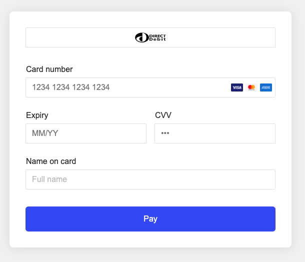

Chris Hutchinson - Solutions Engineer Challenge 

Test Transactions: 7 Total 
Authorized 5 : order-CH123.0.09971472462371866, order-CH123.0.3983271169392686, order-CH123.0.09196400884670686, order-CH123.0.8210111413359875,
order-CH123.0.2453261320506026

Declined 2 : order-CH123.0.7151044521369114, order-123.0.7316126306649526


Added Primer Features:  
1. 3DS is commented out but if you remove the line comments I used the 3DS_Challenge_Success test token to invoke 3DS modal in a few of the authorized transactions. 
2. Added additional information to provide alternate payments on universal checkout. (GooglePay)
3. Also added customer data to payments API call to use vault payment onSuccess.


# Primer Integration Walkthrough

## Getting Started

### Installation

```bash
$ git clone git@github.com:primer-io/integration-walkthrough.git
$ cd ./integration-walkthrough
```

Install the dependencies using yarn or npm.

```bash
# With yarn
$ yarn

# With npm
$ npm i
```

### Set the environment variables

Grab your API Key, or create a new API Key, from [Primer's dashboard](https://sandbox-dashboard.primer.io/developers).


Clone `env.example` and name the cloned file `.env`.

```
$ cp env.example .env
```

Open `.env` and set the environment variable `API_KEY` with the API key available on your dashboard.

```
API_KEY=1234-1234-1234-1234 # Your Primer API Key
```

### Run the server

```bash
# With yarn
$ yarn start

# With npm
$ npm start
```

The server is deployed on port 8880 by default. You can change the port by setting the `PORT` environment variable in the `.env` file.

### Access the checkout

Check the checkout at [http://localhost:8880/](http://localhost:8880/).




